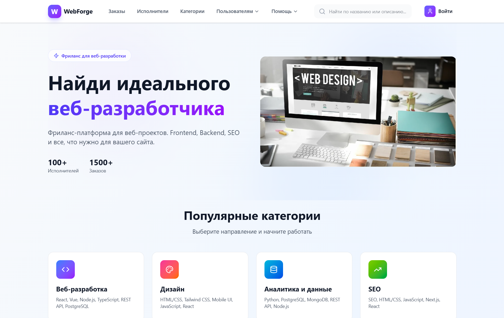
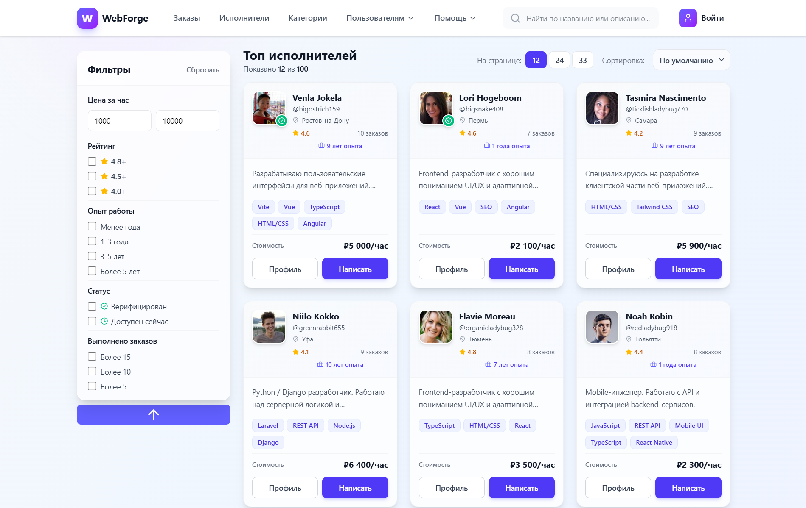
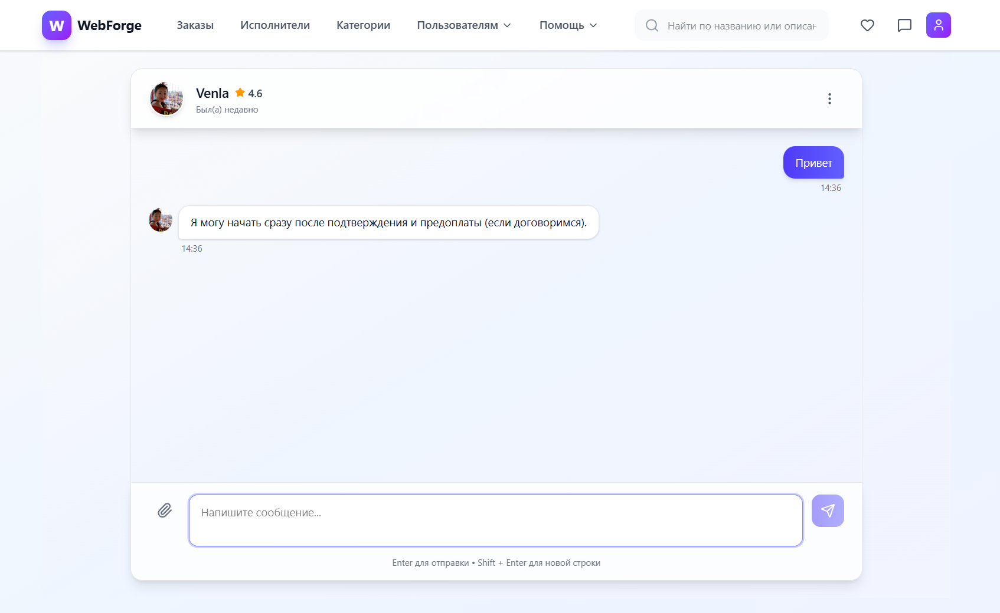
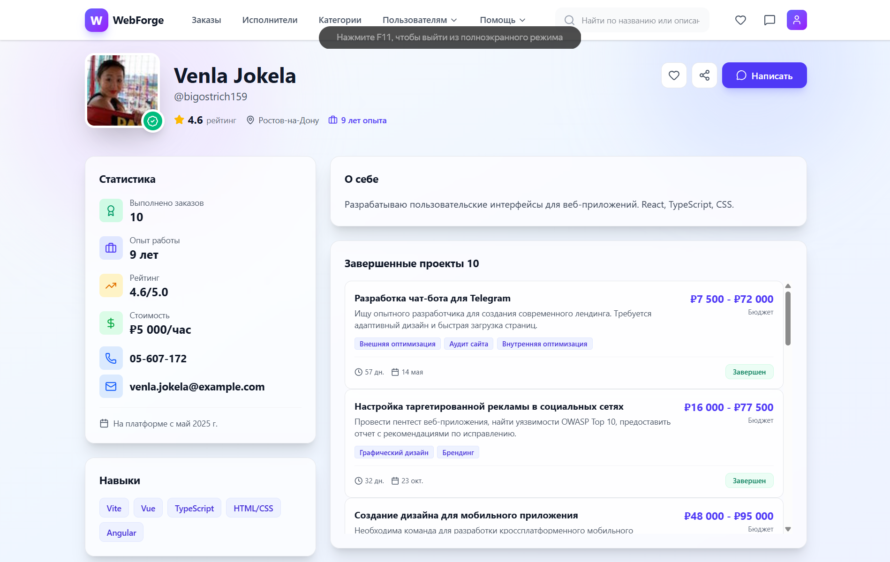

# WebForge React TS

Платформа для взаимодействия заказчиков и фрилансеров.

## [Демо без бекенда (gh-pages)](https://pipidastric1.github.io/WebForge-React-TS/)

## [Демо c бекендом (vercel)](https://web-forge-react-ts.vercel.app/)

## Ветки

- `main`: frontend-версия проекта (без собственного backend).
- `feature/express-backend`: полноценная fullstack-версия (React + Express + Prisma).

Если вам нужна полная серверная логика (авторизация, чаты, избранное, API), используйте ветку `feature/express-backend`.

## Скриншоты

### Главная страница


### Каталог исполнителей


### Чаты и сообщения


### Профиль пользователя



## Сравнение Веток

### `main` — Frontend-версия

Ветка для демонстрации UI/UX и клиентской архитектуры.

Преимущества:

- Быстрый запуск и простой onboarding.
- Фокус на интерфейсах, пользовательских сценариях и состоянии клиента.
- Удобно для быстрых итераций дизайна и прототипирования.

Фишки:

- Каталог исполнителей и заказов.
- Профили пользователей и страницы избранного.
- Сообщения, формы авторизации и создания заказов.

### `feature/express-backend` — Fullstack-версия

Ветка с вынесенной серверной логикой и персистентными данными.

Преимущества:

- Реальная backend-архитектура: Express + Prisma + SQLite.
- Разделение ответственности между frontend и API.
- Централизованный источник данных и более предсказуемый data-flow.

Фишки:

- JWT-авторизация и защищенные роуты.
- API для чатов, лайков, избранного и заказов.
- Хранение данных в базе и server-side обработка бизнес-логики.

## Архитектурные Решения (Коротко)

- Разделение по слоям: `frontend` (UI/роутинг/клиентское состояние) и `backend` (API/бизнес-логика/доступ к данным).
- На frontend используется TanStack Query для кеша, refetch и optimistic update в интерактивных сценариях.
- На backend выбран Express для API и Prisma как ORM для типобезопасной работы с БД.
- Авторизация построена на JWT с middleware-проверкой приватных endpoint-ов.
- Общие типы вынесены в shared-слой для согласованности контрактов между клиентом и сервером.

## О Ветке `main`

Ветка `main` содержит клиентскую часть проекта с UI/UX, роутингом, фильтрами, страницами пользователей и заказов.
Данные в этой ветке ориентированы на frontend-сценарии и демонстрацию интерфейса.

## Технологический Стек

- React
- TypeScript
- Vite
- React Router
- TanStack Query
- Tailwind CSS

## Возможности

- Каталог исполнителей и заказов
- Просмотр профилей
- Страницы избранного
- Страница сообщений и чатов
- Формы авторизации и создания заказа

## Локальный Запуск

### 1. Клонируйте репозиторий

```bash
git clone https://github.com/PiPiDaStRiC1/WebForge-React-TS.git
cd WebForge-React-TS
```

### 2. Установите зависимости

```bash
npm install
```

### 3. Запустите frontend

```bash
npm run dev
```

## Запуск По Веткам

### `main` (только frontend)

```bash
git switch main
npm install
npm run dev
```

### `feature/express-backend` (fullstack)

```bash
git switch feature/express-backend
npm install
```

Запуск frontend + backend:

```bash
npm run dev
```

Опционально (отдельно):

```bash
npm run dev:frontend
npm run dev:backend
```

## Fullstack-Версия

Чтобы запустить fullstack-реализацию:

```bash
git switch feature/express-backend
```

В этой ветке добавлены:

- Express backend
- Prisma + SQLite
- JWT авторизация
- API для чатов, лайков и заказов

## Статус Проекта

Проект активно развивается. Основная fullstack-версия поддерживается в ветке `feature/express-backend`.
